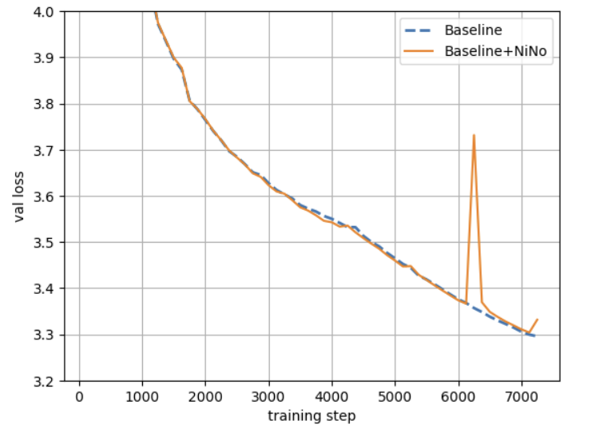

This is a fork of https://github.com/KellerJordan/modded-nanogpt to run the nanogpt benchmark on a **single A100 (80GB)**.
We also provide `train_gpt_nino.py` to run the benchmark with NiNo proposed in [Accelerating Training with Neuron Interaction and Nowcasting Networks](https://github.com/SamsungSAILMontreal/nino).

See the original [modded-nanogpt code](https://github.com/KellerJordan/modded-nanogpt/) for more information about the benchmark.

Baseline:
```commandline
torchrun --standalone --nproc_per_node=1 train_gpt.py
```

With NiNo (first setup the [NiNo code](https://github.com/SamsungSAILMontreal/nino)):
```commandline
export PYTHONPATH=$PYTHONPATH:~/projects/nino;
torchrun --standalone --nproc_per_node=1 train_gpt_nino.py
```

The log files are provided in the `records/nino` folder. The loss plot is provided below.



# Contributions

This is an ongoing effort to improve on this benchmark using NiNo or a similar approach. We welcome contributions to this repository. Please open a pull request or an issue if you have any questions or suggestions.
